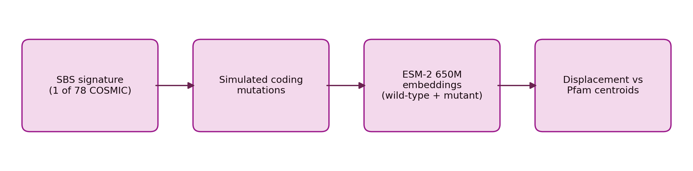
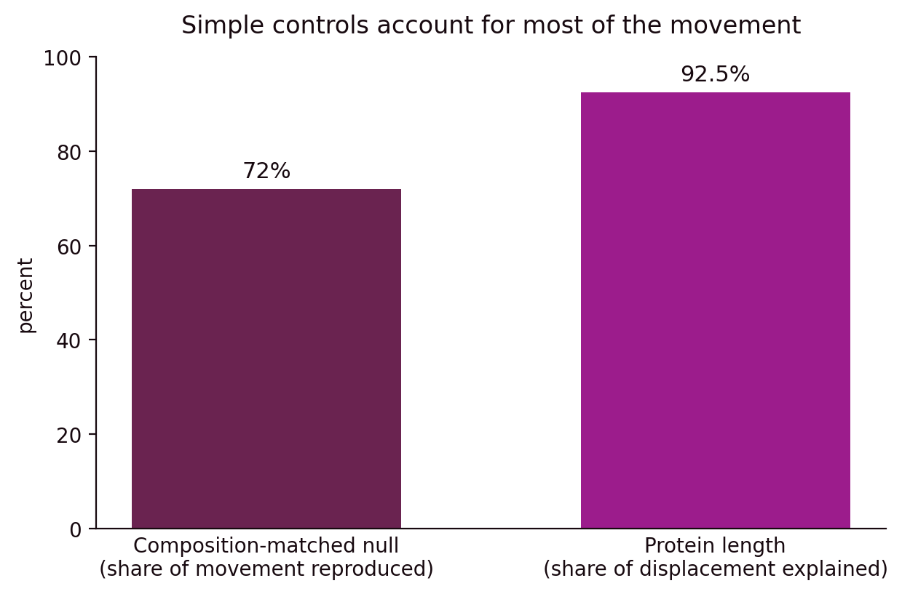
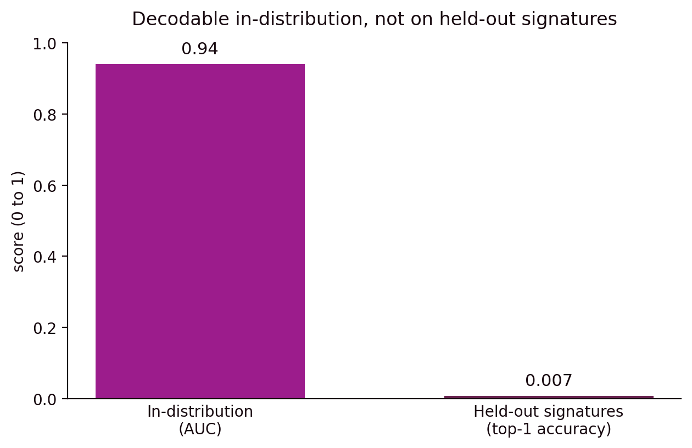

**TL;DR.** I built PRISM to test whether cancer mutational signatures push protein sequences in consistent directions through the embedding space of a protein language model, and I ran the pipeline over all 78 COSMIC single-base-substitution signatures with ESM-2 650M. One signature, SBS17a, steered sequences toward the same Pfam family, PF17041, across two independent Pfam clans, which is the kind of recurrence a real effect would produce. When I added controls the story narrowed, because a composition-matched null reproduced 72% of the movement and protein length explained 92.5% of the displacement, so most of the apparent signal tracks simple sequence properties. An inverse probe decoded the shifts at AUC 0.94 on signatures it had seen and then dropped to 0.7% top-1 accuracy on held-out signatures, so the information was present in-distribution without transferring to new mechanisms.

## I built PRISM to test whether mutational signatures steer protein embeddings

I started PRISM to answer a biological question, whether the mutational processes that damage DNA leave a consistent and readable trace in the proteins they alter. A mutational signature is the characteristic pattern of DNA base substitutions that a process leaves behind, and the COSMIC catalog lists 78 single-base-substitution signatures, each one a probability distribution over base changes in their sequence context. I wanted to know whether these processes move the proteins they hit toward particular regions of a protein model's representation, rather than spreading them around without any shared direction.

To measure that, I built a pipeline that runs from a signature to a geometric measurement. For each signature I sampled mutations on protein-coding sequences according to that signature's substitution probabilities, translated the mutated DNA into protein, and embedded both the wild-type and mutant proteins with ESM-2 650M, a protein language model that maps a sequence to a fixed vector. [DETAIL NEEDED: how many source coding sequences I used per signature, and how I pooled ESM-2 residue embeddings into one vector per protein.] I then compared each mutant cloud against a library of Pfam domain centroids, where Pfam is a database of protein families and a centroid is the average embedding of a family, so a shift toward a centroid means the mutated proteins sit closer to that family in the model's space. [DETAIL NEEDED: the exact displacement metric, for example cosine movement toward a centroid or Euclidean shift.]

**Figure 1.** The pipeline runs from an SBS signature, to simulated coding mutations, to ESM-2 650M embeddings of wild-type and mutant proteins, to displacement measured against Pfam centroids.

To test whether these shifts carried signature-specific information, I trained an inverse probe, a classifier that reads an embedding shift and predicts which signature produced it. I evaluated it two ways, once on signatures it had seen during training and once with entire signatures held out, so I could separate whether the information was present from whether it generalized to new mechanisms. [DETAIL NEEDED: classifier type, how I featurized the shift, the number of signature classes, and the train and test sizes.]

## One signature moved sequences the same way across two clans

On the raw geometry one signature stood out, because SBS17a repeatedly steered sequences toward the Pfam family PF17041, and it did so across two independent Pfam clan runs, which mattered since the same direction appearing in separate protein contexts is what a genuine effect would produce rather than a single coincidence. [DETAIL NEEDED: the names of the two Pfam clans.]

**Figure 2.** [FIGURE NEEDED: SBS17a displacement toward PF17041 in each of the two clan runs, with the other signatures shown for comparison.]

## Simple controls reproduced most of the movement

The controls changed how I read that result. I built a composition-matched null that preserves amino-acid composition while removing the signature's specific structure, and it reproduced 72% of the original embedding movement. When I regressed displacement on protein length, length explained 92.5% of the variation in displacement. Taken together, most of the apparent movement tracks ordinary sequence properties that can line up with a functional axis, so the residual that is specific to the signature is small. [DETAIL NEEDED: whether 72% is the fraction of mean displacement reproduced by the null, and whether 92.5% is an R-squared from the length regression.]

**Figure 3.** The two controls account for most of the movement, since the composition-matched null reproduces 72% of it and protein length explains 92.5% of the displacement.

## The probe decoded signatures it had seen and failed on new ones

The inverse probe told a similar story about generalization. It reached an AUC of 0.94 on signatures represented in training, which says the embedding shifts are separable when the model has already seen the mechanism. On held-out signatures its top-1 accuracy fell to 0.7%, so the probe was reading signature-specific structure that did not transfer to mechanisms it had never seen. [DETAIL NEEDED: the number of signature classes, so the chance rate for the 0.7% held-out result is explicit.]

**Figure 4.** The inverse probe reaches AUC 0.94 on signatures seen in training and 0.7% top-1 accuracy on held-out signatures.

## A decodable signal is not yet understanding

What surprised me was how much a strong baseline changed the question I was asking. Before the controls the useful question looked like whether SBS17a moves embeddings, and after them it became what residual movement remains once composition and length are removed, whether that residual recurs across families, and which residues carry it. The held-out collapse pushed me the same way, since a probe can recover information from an activation without showing that the model learned a portable version of the mechanism.

The main limit is that PRISM measures geometry inside a protein model's representation, so a shift in that space is a statement about the model and not yet a statement about biological function. I am careful not to call SBS17a a validated functional driver, because the composition and length controls remove most of the movement and the probe does not transfer to unseen signatures. [DETAIL NEEDED: any residue-level or causal follow-up I ran to isolate the signature-specific residual after the controls.] For me this work connects representation learning and evaluation, because the same pattern shows up whenever a decodable signal gets treated as understanding before it survives controls and transfer.

## Acknowledgements

I did PRISM as supervised independent research with AITHYRA, and I presented it as an oral at IEEE CIBCB 2026. [DETAIL NEEDED: the supervisor and collaborator names I should credit here.] The code is at github.com/saanviiyer/prism, with related generative-model work at github.com/saanviiyer/genmodels.

## Questions I need you to answer

1. How many source coding sequences did you simulate per signature, and how did you pool ESM-2 residue embeddings into one vector per protein (mean over residues, a CLS-style token, or something else)?
2. What is the exact displacement metric (cosine movement toward a centroid, Euclidean shift, or another definition)?
3. Which two Pfam clans were the independent runs?
4. For the inverse probe: what classifier, what features from the shift, how many signature classes, and what train and test sizes? This sets the chance rate for the 0.7% held-out result.
5. Does 72% mean the fraction of mean displacement reproduced by the composition-matched null, and is 92.5% an R-squared from regressing displacement on length?
6. Were the Pfam centroids computed with the same ESM-2 650M model and dimensionality as the mutant embeddings?
7. Did you run any residue-level or causal follow-up that isolates the signature-specific residual after the controls?
8. Who should I credit in the acknowledgements (supervisor and collaborators)?
9. Which of Figures 1 to 4 already exist in the prism or genmodels repos, and where, so I can embed them instead of the placeholders?
