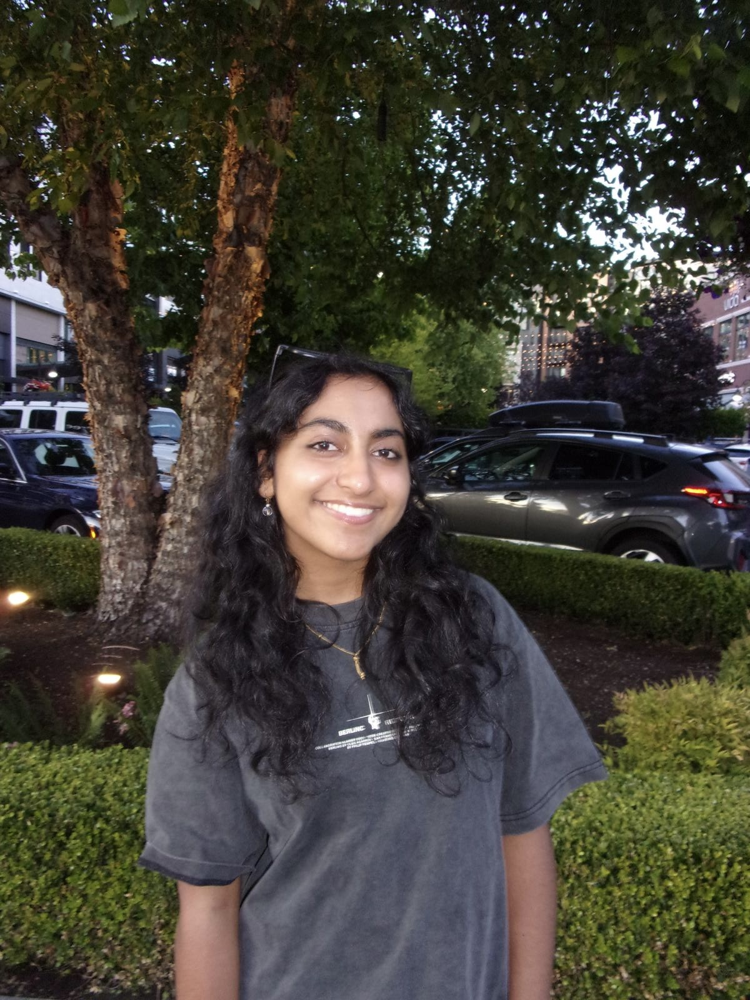

<link rel="stylesheet" href="assets/style.css">

  

    
  

  <h2 class="sidebar-section-title">Projects</h2>
  <ul class="project-list sidebar-projects">
    <li>
      

        BCI Signal Analysis
        Real-time non-invasive brain signal processing.
      

    </li>
    <li>
      

        Multimodal MedAI
        Foundation model fusing EEG and imaging data.
      

    </li>
    <li>
      

        Protein Mutation Prediction
        Leveraging protein LMs for mutation effects.
      

    </li>
  </ul>

## Welcome!
I'm a Computation and Neural Systems undergraduate researcher at the **California Institute of Technology**. 
My research focuses on **brain stimulation and medical AI**, with interest in BCI development.

---

## Research Interests
- Brain stimulation and neural signal processing
- Multimodal medical foundation models
- Predicting mutation effects with protein language models
- Topic modeling in brain tumor development
- Multisensory perception in humans  

---

## Publications
- [**Elucidating Neurodevelopmental Trajectories in Cancer with Topic Modeling: Revealing Persistent External Granule Layer Lineages in Medulloblastoma**, 2025](https://www.biorxiv.org/content/10.1101/2025.11.12.687706v1)  

---

## Awards
- [**People's Choice Award @ Stanford Medicine Comprehensive Cancer Research Conference**, 2024](https://drive.google.com/file/d/1jMRbw48vh7ewmfSiXvcXfDMqBXOKrYhw/view?pli=1)
- [**Sigma Xi Best Display of Interdisciplinary Research**, 2024](https://wssef.org/wssef-2023-special-awards-grades-9-12-2/)
- [**Armed Forces Excellence in Technology (PNW)**, 2024](https://wssef.org/wssef-2023-special-awards-grades-9-12-2/)
- [**SWENext Global Innovator Award**, 2024, 2025](https://swe.org/outreach/swenext-awards/)
- [**NASA Techrise Winner (Team Lead)**, 2024, 2025](https://www.nasa.gov/stmd-flight-opportunities/access-flight-tests/techrise/winners-of-fourth-techrise-student-challenge/)

---

## Contact
Email: [ssubramanian@caltech.edu](mailto:ssubramanian@caltech.edu)  
GitHub: [saanviiyer](https://github.com/saanviiyer)